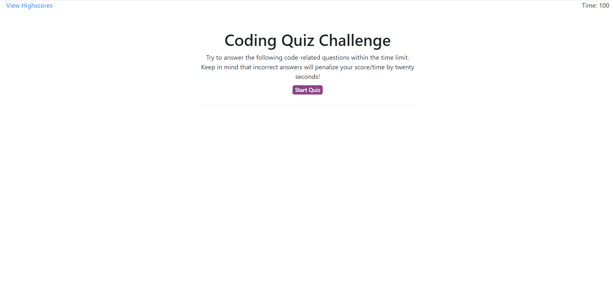

# Code-Quiz

## Description 

This project utilizes DOM manipulation, client-side storage, and javascript fundamentals with arrays and sorting. The project is a JavaScript multiple-choice quiz that generates a score that can be saved to local storage with the highest score listed first. 

The code incorporates event delegation on dynamically created HTML elements and navigating the JavaScript quiz object with questions and answers. The quiz is managed by a JavaScript interval function that displays a countdown timer and will inform the user when the quiz is done.

## Table of Contents 

* [Installation](#installation)
* [Usage](#usage)
* [Credits](#credits)
* [License](#license)

## Installation

Here is the link to the webpage:

https://jgarcia60.github.io/code-quiz 

To install the project files, you can clone the "code-quiz" repository which contains the necessary JavaScript, html, and CSS files at https://github.com/jgarcia60/code-quiz by clicking the green drop down "Code" and cloning the repo with an SSH key.  

## Usage 

You may use this code as your own quiz simulator, or as a tool to develop a template for dynamically creating and appending HTML elements, using local storage, and implementing event delegation and event-handling for dynamic event listeners.

This is what it looks like:

## Credits

All HTML, CSS, and JS files, edits, additions, and revisions were done by Jonathan Garcia (https://github.com/jgarcia60/code-quiz). 

## License

MIT License

Copyright (c) [2020] [Jonathan Garcia]

Permission is hereby granted, free of charge, to any person obtaining a copy
of this software and associated documentation files (the "Software"), to deal
in the Software without restriction, including without limitation the rights
to use, copy, modify, merge, publish, distribute, sublicense, and/or sell
copies of the Software, and to permit persons to whom the Software is
furnished to do so, subject to the following conditions:

The above copyright notice and this permission notice shall be included in all
copies or substantial portions of the Software.

THE SOFTWARE IS PROVIDED "AS IS", WITHOUT WARRANTY OF ANY KIND, EXPRESS OR
IMPLIED, INCLUDING BUT NOT LIMITED TO THE WARRANTIES OF MERCHANTABILITY,
FITNESS FOR A PARTICULAR PURPOSE AND NONINFRINGEMENT. IN NO EVENT SHALL THE
AUTHORS OR COPYRIGHT HOLDERS BE LIABLE FOR ANY CLAIM, DAMAGES OR OTHER
LIABILITY, WHETHER IN AN ACTION OF CONTRACT, TORT OR OTHERWISE, ARISING FROM,
OUT OF OR IN CONNECTION WITH THE SOFTWARE OR THE USE OR OTHER DEALINGS IN THE
SOFTWARE.

---